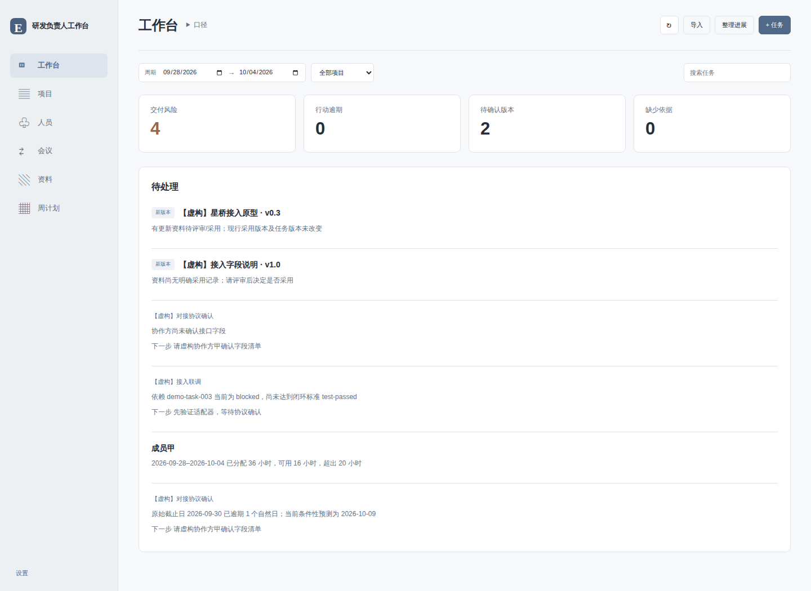

# Engineering Lead Workbench · 研发负责人工作台

**Obsidian 原生社区插件 · v0.1.0 开发中 · 本地优先 · MIT**

把散落在项目、任务、人员和会议记录中的信息，组织成研发负责人每天可以使用的工作台。只维护一套 Markdown 事实记录，从工作台、项目、人员、会议、资料、周计划六个入口阅读同一份数据。

> 这是可安装的 Obsidian 插件项目，不是网页模拟器。v0.1.0 使用离线规则辅助整理和确定性计算，没有调用大语言模型，也不会把推测自动写成事实。项目当前不声称已上架 Obsidian 社区插件目录。



*截图来自当前六入口版本的 GitHub Actions 浏览器 UI 测试环境，使用完全虚构数据；不是 Obsidian 实机截图。[会议](docs/screenshots/workbench-meetings.png) · [资料版本库](docs/screenshots/workbench-materials.png) · [窄屏资料卡片](docs/screenshots/materials-mobile.png) · [人员](docs/screenshots/workbench-people.png)*

## 它适合解决什么

- 先看到阻塞、依赖、逾期、长期未更新、容量未知、超出容量和待协调事项，再进入具体任务
- 从项目目标钻取到模块、执行人、任务和原始 Markdown 记录
- 在所选周期内讨论真实可用容量与已排入工时，不把总剩余工时混成本周负荷
- 通过记录来源、更新时间、下一步行动和协调期限，减少会议后的信息丢失
- 冻结一版周计划，继续记录新增范围和偏差，保留原承诺
- 生成有来源可追溯的周会摘要，人工复核后保存成 Vault 内的 Markdown

## 六个工作入口

| 入口 | 主要问题 | 关键内容 |
| --- | --- | --- |
| 工作台 Workbench | 今天最需要我介入什么？ | 异常、任务状态和可追溯来源 |
| 项目 Projects | 项目被什么卡住？ | 项目详情分栏；原定日期、预测日期、关联会议与资料 |
| 人员 People | 这段时间还能安排多少？ | 工作日历、可用容量、周期负荷、未知容量和超负荷提示 |
| 会议 Meetings | 哪些决定已确认，谁接下一步？ | 纪要、讨论/已确认决策、未决项、行动、录音与转写链接 |
| 资料 Materials | 哪一版已采用，任务依据哪一版？ | 文档与原型的不可变版本、来源、显式采用记录与固定版本引用 |
| 周计划 Weekly Plans | 原计划兑现了吗？后来加了什么？ | 周期选择、冻结基线、当前计划差异、周会摘要 |

项目详情分为“概览 / 任务 / 人员 / 会议 / 文档 / 原型”六个页签，并支持显式里程碑；是否完成由人工记录，不按任务比例自动推断。资料列表按版本列出名称、类型、版本、状态、更新时间与打开入口；详情可查看历史及固定版本引用，手动采用或登记新版，不提供自动差异引擎。

所有入口共用 Vault 中的记录。改动确认后的任务属性，其他入口读取的也是同一条任务；无需维护六份看板。协调对象、期限和下一步保留在任务及相关项目中；会议入口同时保留阻塞协调和既有决策记录。

[GitHub 仓库](https://github.com/LiuYi217/obsidian-engineering-workbench) · [发行版本](https://github.com/LiuYi217/obsidian-engineering-workbench/releases)

## 安装

最低声明版本为 Obsidian 1.5.0。请先在测试 Vault 中安装，并为真实 Vault 做备份。普通记录与线上 URL 使用通用 Obsidian 能力；本地原型的系统默认外部应用打开仅支持桌面 Electron 适配器，移动端明确不支持本地外部打开。声明兼容不等于每个设备都已完成实机测试。

当前会议、资料和原型扩展尚未发布或打新标签，版本号仍为 0.1.0；以下能力以当前源码为准，不代表已有发行资产包含这些改动。

### 手动安装发行文件

1. 从你信任的本项目发行包取得 **main.js、manifest.json、styles.css**，三个文件须来自同一版本
2. 在目标 Vault 中创建 `.obsidian/plugins/engineering-lead-workbench/`（若自定义了配置目录，以实际目录为准）
3. 将三个文件直接放入该目录，不要额外套一层 `src/` 或发行包目录
4. 重启 Obsidian，进入“设置 → 第三方插件”，按自己的安全策略启用社区插件，并启用 **Engineering Lead Workbench**
5. 在命令面板运行“打开研发负责人工作台”

目录应为：

```text
Your Vault/
  .obsidian/plugins/engineering-lead-workbench/
    main.js
    manifest.json
    styles.css
```

源码压缩包中的 TypeScript 文件不能代替 `main.js`。本项目的构建与打包方式见后文。

### BRAT（可选）

当维护者已发布可访问的 GitHub 仓库和对应 release 资产后，可以通过 [BRAT 的官方项目](https://github.com/TfTHacker/obsidian42-brat)添加该仓库测试更新。请使用真实发布地址，不要把示例仓库名当成安装地址。BRAT 是第三方插件；使用 BRAT 不代表本插件已进入 Obsidian 社区目录。

### 更新与停用

先备份，再替换同一插件目录中的三个发行文件并重启。停用插件不会自动删除工作记录。若要卸载，建议先停用插件，保留或另行备份 `Engineering Workbench/`，再通过 Obsidian 的插件管理卸载。不要把删除记录目录误认为普通升级步骤。

## 开始使用

1. 在设置中确认数据目录、默认闭环状态、过期提醒天数和默认工作日历
2. 建立项目、模块和人员记录，给每个人填入已确认容量；未确认的容量保留缺失
3. 从 TAPD/WBS 等主系统导出 CSV 或 JSON，再运行“导入任务（CSV / JSON）”
4. 检查导入预览中的字段、日期、任务 ID、状态和重复项，确认后再写入
5. 登记会议，粘贴或导入纪要文本并预览；区分讨论、建议和已确认决定，再确认保存。需要改变任务字段时使用“整理本次进展（离线规则辅助）”并单独审查
6. 在周计划会议确定范围后创建冻结基线；后来新增任务单独反映，不覆盖基线

TAPD/WBS 等业务系统仍由团队决定是否作为权威来源。此插件只读取人工导出的文件/文本并在 Vault 中整理，**没有自动双向同步、远程写回、实时状态保证或冲突自动裁决**。外部系统与 Vault 不一致时，应由负责人核对并保留来源。

## 计算规则

### 闭环有明确含义

任务状态支持：`planned`、`in-progress`、`blocked`、`dev-complete`、`test-passed`、`released`、`accepted`、`cancelled`。

默认闭环阈值是 `test-passed`。达到或超过选定阈值的任务计入闭环；开发完成、测试通过、发布、验收仍作为不同状态保存。取消是独立状态，不是“完成”。不要把“开发完成”自动写成“已发布”，也不要用取消工作美化完成情况。

### 容量跟着真实周期和日历走

选择的起止日期都是包含当天的自然日期。工作日由每个人自己的日历（有则优先）或默认日历确定；`weekdays` 用 0–6 表示周日至周六，`exceptions` 为特定日期覆盖是否工作。请人工维护适用的节假日和调休，插件不联网推断法定日历。

```text
周期毛容量 = 周期工作日数 × 日容量
周期可用容量 = max(0, 毛容量 − 请假 − 会议 − 支持 − 缓冲)
周期负荷 = 与该周期重叠的显式 allocations 分摊工时
```

`hoursPerDay` 优先；只提供 `weeklyHours` 时，按该日历的常规每周工作日数换算日容量。扣减和任务安排按其日期区间与所选周期的工作日重叠进行分摊。详情和边界规则见 [数据模型](docs/data-model.md)。

剩余工时用于表达还剩多少工作；周期安排用于表达这段时间具体排了多少。缺少容量显示“未知”，缺少排期单列提示，不自动补为零或假定全部排入当前周。负荷用于协商计划、支持和资源取舍，**不是个人绩效排名或生产率评价**。

### 日期与预测

- `originalStart` / `originalDue`：原定计划日期，后续整理不会以新预测覆盖原定日期
- `forecastDue`：当前条件下的预测完成日，变更应保留来源和时间
- `lastUpdated`：记录更新时间；长期未更新意味着需要确认，不等同于没有工作
- 预测依赖人员容量、任务范围、依赖和排期等输入；输入不完整就不能形成确定承诺

### 冻结基线

基线是确认时任务集合的独立快照。当前记录可以变化，插件不会回写已有基线。比较时区分新增、移除和字段变更，并保留原定日期与预测偏差。基线文件是普通 Markdown，人工或其他插件仍可能改动，因此它是工作流上的冻结，不是防篡改审计存储。

## 离线整理，不冒充 AI

“整理本次进展”使用可解释的本地规则识别候选任务和字段。它不会调用 LLM、上传正文、自动决定任务事实或自动批准更新。

1. 输入进展文本，查看规则识别出的候选项和原文
2. 核对任务匹配、旧值、新值和依据
3. 对需要应用的变更作显式确认
4. 未匹配、歧义或未确认内容保留为待整理信息，不计入任务事实、完成率或负荷

简单规则不能可靠理解否定、上下文、代词、相对时间和隐含依赖。任何“建议”“预计”“可能”都需要保留其条件，不能转换为已完成事实。手动修正任务属性仍是重要工作方式。

## 会议、资料与原型

### 会议保留原文与决定状态

会议记录时间、参与人、项目/模块、迭代、原文、录音与转写来源链接。纪要文本可粘贴或导入，插件不录音、不下载音频，也不自动转写。讨论、建议和已确认决定分别保存；未决项单列，行动项可关联已有任务并记录负责人及截止日期。

先查看预览和原文，再确认写入。保存会议不会凭文本推断任务已完成，也不会自动创建承诺。已有任务变更仍需独立确认。规则建议、转写内容和原型页面中的说明都不是已确认事实。

### 资料版本与采用

文档和原型使用同一份资料库。每次收到修订都建立新的不可变 `MaterialVersion`，保留资料身份、版本号、项目、来源、提供者、源 URL/文件、变更说明、评审问题及预览记录；不会用新版覆盖旧版。

采用操作另建 `Adoption`，明确指向一个版本。最新收到、已评审和已采用是不同概念。任务与会议引用确切的版本 ID；新增版本或采用新版都不会自动切换已有引用。需要改用新版时，应单独审查并确认对应任务或会议的引用。

### 原型收件与打开

支持单 HTML、文件夹、ZIP 和 HTTP(S) 在线 URL。收件先检查文件与入口，再预览待保存的版本；保留来源、原始文件信息和资源目录结构。ZIP 需通过路径、资源量和不安全条目检查，不能借导入写到目标目录之外。

插件不执行原型脚本，不嵌入 iframe，不启动 Web 服务器，也不托管上传内容。查看原型需主动交给系统默认外部应用打开：线上 URL 可用于桌面和移动端；本地资源仅通过桌面 Electron 适配器打开，移动端会明确提示不支持。打开后，原型自身的网络请求、登录、外部资源与代码行为由浏览器及来源站点控制；预览记录不构成安全认证。

更多操作与边界见 [会议、资料和原型流程](docs/workflows.md) 及 [隐私与安全](docs/privacy.md)。

## 周会摘要

摘要按相同输入和配置作确定性汇总，包含周期、完成口径、任务状态、风险/阻塞、容量、计划差异和来源。事实、预测、人工判断应分别标记，缺失资料和未知容量应可见。摘要只能反映已有结构化记录；保存前应核对关键事项。

报告保存为 `Reports/` 下的 Markdown，不会自动发送邮件、群消息或外部系统。不因生成周报而把任务标记为已完成。

## 数据与隐私

默认目录结构：

```text
Engineering Workbench/
  Projects/    # 项目
  Modules/     # 模块与归属
  People/      # 人员、工作日历、容量扣减
  Tasks/       # 当前任务事实与预测
  Decisions/   # 决策及来源
  Meetings/    # 会议、原文、决策和行动
  Materials/   # 不可变的资料版本
  Adoptions/   # 对确切版本的采用记录
  Assets/      # 按版本隔离的原始包和本地资源
  Baselines/   # 冻结快照
  Reports/     # 已保存的周会摘要
  Inbox/       # 待确认进展
```

- 记录为普通 Markdown + YAML frontmatter，无专用数据库要求，可用 Obsidian 自己编辑与备份
- 识别键为 `workbench` 和 `id`；引用使用稳定 ID，不依赖显示名称
- 已确认任务更新保留自定义属性和正文；已有文件被其他地方更新时，需刷新后重审
- 插件不主动抓取来源、不使用 API Key、不采集遥测、不内置外部模型服务；主动打开外部链接/原型后，浏览器和原型可能联网
- Vault 本身的同步、备份、其他插件和你的分享动作仍可能传输记录，取决于各自配置
- 不要把密码、令牌、TAPD 登录凭据或敏感个人评价写入示例、导入文件或问题报告

见 [数据模型与 frontmatter 示例](docs/data-model.md)、[导入与日常使用](docs/workflows.md)、[隐私与安全](docs/privacy.md)。

## 开发与构建

需要 Node.js 与 npm。建议使用仍受支持的 Node.js LTS，在独立测试 Vault 中开发。

```bash
npm install
npm run typecheck
npm test
npm run build
npm run package
```

- `npm run dev`：监听源码并重建
- `npm run check`：执行类型检查、测试和构建
- `npm run build`：生成生产 `main.js`
- `npm run package`：构建并生成发行目录/安装包，实际产物以脚本输出为准

仅把 `main.js`、`manifest.json`、`styles.css` 作为运行资产安装；`node_modules/`、源码和开发配置不是安装所必需。仓库中的测试覆盖计算和数据规则；通过自动化测试不等于已完成真实 Obsidian 或移动端验收。人工检查表见 [发布与验收](docs/release-checklist.md)。

## 范围与限制

v0.1.0 聚焦单个 Vault 的个人负责人工作流。没有多用户数据库、服务端权限管理、实时协作锁、TAPD API 连接、自动排程优化器、个人绩效打分或云端模型。多人共同编辑时，仍需使用 Vault 同步工具并处理冲突。

导入、文本整理和预测都是辅助工具。请先预览、确认并保留来源；不能把缺失数据、规则建议或演示结果当成真实项目事实。

## English overview

Engineering Lead Workbench is a native, local-first Obsidian community-plugin project for engineering leads. Shared Markdown records power six views: Workbench, Projects, People, Meetings, Materials, and Weekly Plans.

It offers explicit status semantics (default closure: test-passed), configurable working calendars, leave/meeting/support/buffer deductions, unknown-capacity warnings, period allocations, frozen planning snapshots, reviewed CSV/JSON imports, offline rule-assisted update previews, and deterministic source-backed meeting summaries. Meeting minutes are imported or pasted, reviewed, and explicitly confirmed; audio is not transcribed. Immutable document/prototype versions use separate adoption records, while tasks and meetings pin exact versions. Prototype intake accepts HTML, folders, ZIP, or online URLs with guarded local packaging. It does not embed a prototype, execute it in Obsidian, or run a hosting server. External local opening requires desktop Electron; mobile supports online URLs only. It does not call an LLM, sync with TAPD automatically, rank individual performance, or send vault contents to a service.

Install matching `main.js`, `manifest.json`, and `styles.css` into `.obsidian/plugins/engineering-lead-workbench/`, then enable the plugin. This repository does not claim an approved community-directory listing. Synthetic fixtures are development-only and excluded from the production plugin; there is no fictional-record creation command.

### Official developer references

- [Obsidian: Build a plugin](https://docs.obsidian.md/Plugins/Getting%20started/Build%20a%20plugin)
- [Obsidian TypeScript API definitions](https://github.com/obsidianmd/obsidian-api/blob/master/obsidian.d.ts): Plugin, ItemView, Vault, TFile, MetadataCache and FileManager
- [Obsidian sample plugin](https://github.com/obsidianmd/obsidian-sample-plugin)
- [Obsidian manifest reference](https://docs.obsidian.md/Reference/Manifest)
- [Obsidian: Submit your plugin](https://docs.obsidian.md/Plugins/Releasing/Submit%20your%20plugin)

## 许可证

[MIT](LICENSE) · Copyright © 2026 Engineering Lead Workbench contributors

## 验证状态

当前会议、资料与原型扩展在提交 `e665e90` 通过 111 项核心/安全/模拟原生交互测试，以及 26 项桌面/窄屏浏览器测试；依赖审计为 0。真实 Obsidian 桌面和移动端仍未实测，详见 [验证记录](docs/verification.md)。

基于模拟 Obsidian API 的契约测试不等于实机测试。尚未完成真实 Obsidian 桌面或移动端验证，也没有社区目录上架声明。

开发者可运行 `npm run preview:build`，然后 `node scripts/preview-server.mjs` 查看完全虚构数据的 UI 测试环境；该环境不会模拟 Vault 的原生写入。浏览器测试需先执行 `npx playwright install chromium`，再运行 `npm run test:browser`。

合成数据仅保留在 `tests/fixtures/`，供自动化测试和开发预览使用，不进入生产包。插件没有创建虚构记录的入口；更新不会删除 Vault 中已有的任何记录。
